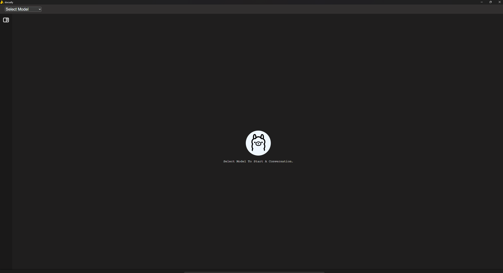
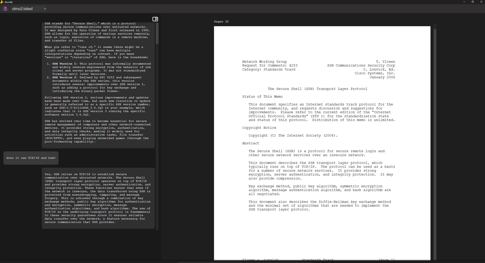

# Docsally

<p align="center">

</p>


> [!NOTE]
> Docsally now in its alpha version.

## 📋 Prerequisites

- <a href="https://ollama.com">Ollama</a>
- Nomic-embed-text model (The Nomic-Embed-Text model will be downloaded automatically when the application runs.)

> [!NOTE]
> The application may temporarily freeze while installing the Nomic-Embed-Text model, which is expected behavior.

## 📖 Description

**Docsally** is a simple AI document reader that helps you understand and summarize PDFs easily. It uses Ollama to run local AI models, extracts content from PDF files, and turns it into smart vectors stored in a vector database. This allows you to ask questions and get quick, accurate answers based on your documents.

Docsally is built to be easy to use—not complicated. More features will be added and improved in future updates to make your experience even better.

## 📸 Showcasing

<p align="center">

</p>

<p align="center">

</p>

## 🔧 Installation

### Windows:

- Download the binary (msi) from the <a href="https://github.com/hish22/docsally/releases">Releases</a> page.

Next, run the msi file to begin installing the program.

### Linux(Ubuntu based):

- Download the binary (deb) from the <a href="https://github.com/hish22/docsally/releases">Releases</a> page.

then run this command to install it:

```bash
sudo dpkg -i <package-location>
```

`<package-location>` means the location of the package, example of a location /example/download/docsally_0.1.0_amd64.deb

to start the app type:

```bash
docsally
```

## 🎲 Basic usage

- to zoom-in use (ctrl)
- to zoom-out use (alt)

> <package-location> means the location of the package, example of a location /example/download/docsally_0.1.0_amd64.deb

## 📢 Reporting Issues

If you encounter any problems, bugs, or have feature requests, feel free to open an issue!
